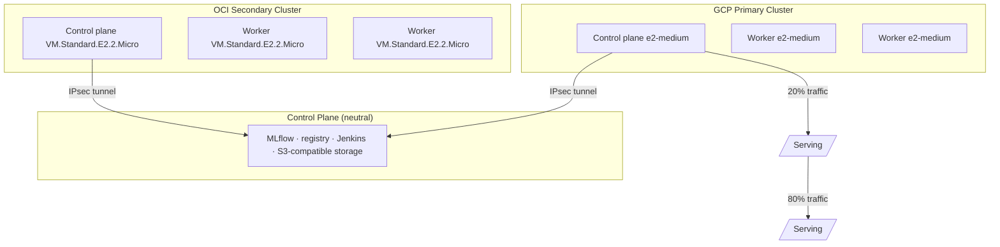

# Ferry — Cloud-Portable ML Platform for EU Financial Services (DORA)

> Target product name: **Ferry** — a provably portable ML platform for EU financial
> services operating under DORA cloud-concentration and exit-strategy requirements.
>
> This is the specification of record. The infrastructure choices are deliberate and
> unchanged in spirit from the earlier multi-cloud build: Terraform, Ansible,
> self-managed Kubernetes, MLflow, FastAPI, Jenkins, Prometheus/Grafana, k6, and a split
> across two cloud providers. What changed is the answer to the question every reviewer
> asks: **"why two clouds?"** Ferry's answer: because EU financial entities are legally
> required to prove they can leave a cloud provider, and the only credible way to prove
> it is to do it — continuously, on real traffic, in CI.

---

## 1. Goal

Build a real ML pipeline (train → track → serve → monitor) that runs **identically on two
cloud providers**, where **portability is continuously verified** — not asserted in a
document. Scope is intentionally tight: no enterprise overengineering, but the engineering
that exists must be defensible to a regulator, a security reviewer, and a CFO.

The single testable promise of Ferry:

> **The exit test is a CI job.** Any point in time, the platform can move 100% of traffic
> to the surviving provider within 4 hours (RTO), losing at most 15 minutes of data (RPO),
> and produce signed evidence that it did.

---

## 2. Why two clouds: the enterprise problem

Multi-cloud is not free. It is a real cost paid for a real reason. A churn-model demo split
across two providers would be *strictly worse* than single-cloud: cross-cloud egress cost,
public-IP scraping, two IAM models, two Terraform state files, and a latency-exposed MLflow
dependency. Ferry exists because of one regulatory fact:

**EU financial entities are legally required to prove they can leave a cloud provider.**

The Digital Operational Resilience Act (DORA) has applied to EU banks, insurers, and
investment firms since January 2025. Two of its requirements drive this platform directly:

- **Concentration risk (Art. 29).** Entities must assess and limit dependency on a single
  critical ICT third-party provider. A regulator can require an entity to reduce exposure
  where concentration is deemed excessive.
- **Exit strategies (Art. 28).** Contracts with critical ICT providers must include exit
  plans that are **documented and tested**, allowing the entity to leave without disrupting
  business continuity or breaching regulatory obligations.

The gap: nearly every institution's "exit strategy" is a PowerPoint deck. It has never been
executed. Nobody knows how long it would take or whether it would work, because testing it
would mean rebuilding production somewhere else — which nobody has budget or appetite for.
Meanwhile the same institutions have concentrated their entire ML estate on one
hyperscaler's managed services (SageMaker, Vertex AI, Azure ML): precisely the services with
the deepest lock-in, because training jobs, feature definitions, registry, and serving are
all expressed in provider-proprietary APIs.

**Ferry is the ML platform where the exit test is a CI job.** Portability is not asserted;
it is continuously verified.

### 2.1 Why this justifies every stack choice

| Original choice | Looked like | Actually is |
|---|---|---|
| Self-managed kubeadm, not GKE/EKS | Doing it the hard way | The *only* way to keep the orchestration layer identical across providers. A managed control plane is provider-specific by definition |
| MLflow instead of Vertex AI / SageMaker | Cheaper open source | Registry and tracking that move with you; the model registry is the hardest thing to migrate |
| Terraform with per-provider modules | Standard practice | The portability mechanism — same module interface, swappable provider implementation |
| Ansible for everything above the VM | Old-fashioned | Provider-neutral configuration; cloud-init and managed node pools are not |
| Jenkins in a container, not a managed CI service | Avoiding cost | CI that runs anywhere, including on-prem, during an actual exit |
| Two clouds simultaneously | Showing off | The exit path is *permanently warm*, not theoretical |
| Public-IP allowlisting between clouds | A shortcut | Honest about the cost of cross-cloud networking — fixed properly with IPsec + federation (see §15) |

---

## 3. Who pays

| Buyer | Their pain | Trigger |
|---|---|---|
| CIO / Head of Cloud, EU bank or insurer | Regulator asked for evidence the exit plan works; there is none | DORA supervisory review, or a joint examination team request |
| Chief Risk Officer | Concentration risk register lists "all ML on one provider" with no mitigation | Annual risk assessment |
| Head of Infrastructure | Renewal negotiation with a hyperscaler where the institution has zero credible walk-away | Contract renewal cycle |
| FinOps lead | Committed-use discounts locked to one provider; no leverage, no arbitrage | Budget pressure |

The commercial argument has two halves, and the second one is what actually closes deals:

**Compliance:** produce tested exit evidence instead of an untested document.

**Negotiating leverage:** an institution that can demonstrably move its ML workload in days
negotiates its cloud contract from a completely different position. Hyperscaler
committed-use agreements at enterprise scale run into eight figures annually. A few
percentage points of discount, won because the walk-away threat is credible, pays for this
platform many times over. This is the argument the CFO understands.

---

## 4. Cloud Split — symmetric, not asymmetric

Both providers run the **same stack**. Both have a Kubernetes cluster. Both serve
production traffic. Traffic distribution is a routing decision, not an architectural one.

| Cloud | Role |
|---|---|
| **Google Cloud (GCP)** | Primary serving — self-managed Kubernetes (kubeadm), lapse API, Postgres |
| **Oracle Cloud (OCI)** | Secondary serving — self-managed Kubernetes (kubeadm), lapse API, Postgres |

> No AWS or Azure. Add only if explicitly requested.
>
> Why not asymmetric (GCP serves, OCI trains)? Because then OCI has never proven it can
> serve, and the exit test fails exactly when it matters. Both clusters must be able to
> serve, every day.

```
                             ┌──────────────────┐
                             │   Global DNS /   │
                             │  health-checked  │
                             │     routing      │
                             └────┬────────┬────┘
                    weight: 80%   │        │  weight: 20%
                    ┌─────────────▼──┐  ┌──▼──────────────┐
                    │   GCP region   │  │   OCI region    │
                    │  ┌──────────┐  │  │  ┌──────────┐   │
                    │  │ k8s (3n) │  │  │  │ k8s (3n) │   │
                    │  │ lapse-api│  │  │  │ lapse-api│   │
                    │  │ postgres │  │  │  │ postgres │   │
                    │  └──────────┘  │  │  └──────────┘   │
                    └────────┬───────┘  └───────┬─────────┘
                             │                  │
                             └────────┬─────────┘
                                      │
                        ┌─────────────▼──────────────┐
                        │   Control plane (neutral)   │
                        │  MLflow · registry · Jenkins│
                        │  artifacts on S3-compatible │
                        │  object storage             │
                        └─────────────────────────────┘
```

**The 80/20 split is deliberate.** A cold standby is not a tested exit path — it is another
untested document. Continuously serving 20% of real traffic from the secondary provider
means the exit path is exercised every single day, and any drift between environments
surfaces immediately rather than during an emergency.

---

## 5. Stack (fixed — do not substitute)

| Layer | Tool |
|---|---|
| IaC | Terraform (shared module interface, per-provider implementations) |
| Config management | Ansible (provider-neutral roles) |
| Containers | Docker |
| Orchestration | Kubernetes (kubeadm, self-managed, on both providers) |
| Packaging on K8s | Helm (per-provider values files) |
| Secrets | Provider-neutral (Sealed Secrets with keys outside both clouds, or self-hosted store) |
| CI/CD | Jenkins (Docker container, neutral control plane) |
| Experiment tracking | MLflow (S3-compatible artifact store) |
| Model serving | FastAPI |
| Database | PostgreSQL (StatefulSet on each cluster) |
| Metrics | Prometheus (per provider) + Grafana (central, federated) |
| mTLS | cert-manager |
| Load testing | k6 |
| ML framework | scikit-learn (Gradient Boosting) |

---

## 6. ML Use Case: Policy Lapse & Renewal-Risk Prediction

**Use case: policy lapse and renewal-risk prediction for a European general insurer.**

Why this workload:

- The buyer is already in scope for DORA — same room, same budget.
- The economics are unambiguous and the insurer already tracks them.
- It is a genuinely hard prediction problem with real seasonality and price sensitivity,
  not a toy dataset with a 0.85 AUC ceiling.

**The business loop:**

```
Policy approaching renewal (T-45 days)
        │
        ▼
Lapse-risk model scores the policy
        │
        ├─ Low risk    → standard renewal notice, no intervention
        ├─ Medium risk → retention email, loyalty discount offer
        └─ High risk   → outbound call from retention team + priced retention offer
```

**Economics that make the model's value calculable:**

| Quantity | Typical value | Notes |
|---|---|---|
| Book size | 400,000 active policies | Mid-size regional insurer |
| Average annual premium | €520 | Motor/home mix |
| Baseline annual lapse rate | 14% | ~56,000 lapsing policies |
| Retention offer cost | €35 average | Discount plus contact cost |
| Retention success rate when correctly targeted | 22% | Industry-plausible |

If the model lifts correctly-targeted retention interventions such that 2 percentage points
of the lapsing book is saved, that is ~1,120 policies at €520 = **€582k retained annual
premium**, against roughly €40k of intervention cost on the targeted segment. The
sensitivity that matters is *precision*, because intervention cost scales with how many
policies you contact — a model that flags everyone as high-risk destroys the economics even
if its recall is perfect.

### 6.1 Model objective: expected value, not AUC

**Do not optimise AUC. Optimise expected value at a fixed intervention budget:** rank
policies by `P(lapse) × premium × P(save | contacted)` and take the top N where N is what
the retention team can actually call. That framing — capacity-constrained ranking rather
than classification — is what separates someone who has deployed a model into a business
process from someone who has run `train_test_split`.

Metrics logged to MLflow: expected-value-at-budget on the hold-out set, precision@N at the
contactable capacity, plus accuracy/f1/roc_auc for reference. The CI gate is on
expected value, not AUC.

### 6.2 Label feedback loop

Retention campaign outcomes feed back as labels: whether a contacted policy renewed or
lapsed must land back in the training set within **60 days of scoring**. Without this loop
the model silently optimizes for the wrong thing — intervention only pays when you know
whether it worked.

---

## 7. Infrastructure

### GCP VMs (primary cluster)

| Name | Role | Size |
|---|---|---|
| `gcp-k8s-cp` | Kubernetes control plane | e2-medium |
| `gcp-k8s-w1` | Kubernetes worker 1 | e2-medium |
| `gcp-k8s-w2` | Kubernetes worker 2 | e2-medium |

### OCI VMs (secondary cluster)



| Name | Role | Shape |
|---|---|---|
| `oci-k8s-cp` | Kubernetes control plane | VM.Standard.E2.2.Micro |
| `oci-k8s-w1` | Kubernetes worker 1 | VM.Standard.E2.2.Micro |
| `oci-k8s-w2` | Kubernetes worker 2 | VM.Standard.E2.2.Micro |

### Control plane (neutral)

| Host | Role |
|---|---|
| `control-plane` | MLflow tracking server, model registry, Jenkins, artifact staging (S3-compatible object storage) — reachable from both clusters over the IPsec tunnel; not part of the serving path |

> PostgreSQL runs inside Kubernetes as a StatefulSet on **each** cluster (one per provider,
> ~5Gi PVC). No dedicated PostgreSQL VM.

---

## 8. The Portability Contract

A machine-checkable definition of what "portable" means. This is the specification's core
technical artifact.

```yaml
# portability-contract.yaml
forbidden_dependencies:
  - managed_kubernetes          # GKE, EKS, OKE control planes
  - provider_ml_platform        # Vertex AI, SageMaker, Azure ML
  - provider_managed_database   # Cloud SQL, RDS, Autonomous DB
  - provider_serverless         # Cloud Run, Lambda, Functions
  - provider_specific_iam_in_app_code

required_abstractions:
  object_storage: s3_api          # works against GCS interop, OCI Object Storage, MinIO
  container_registry: oci_distribution_spec
  secrets: kubernetes_secrets     # not Secret Manager, not KMS-specific
  ingress: nginx_ingress          # not provider LB controllers
  identity: oidc                  # not provider-native service accounts in app code

exit_objectives:
  rto_hours: 4       # time to full traffic on the surviving provider
  rpo_minutes: 15    # tolerable data loss
```

A CI job parses Terraform plans and Kubernetes manifests and **fails the build** on any
forbidden dependency. Portability that is not enforced in CI decays within one sprint,
because the fastest path to shipping any given feature is always the managed service.

---

## 9. Repository Structure

```
ferry/
├── terraform/
│   ├── modules/                 # shared module interface (network, vm, ipsec)
│   ├── gcp/                     # provider implementation: VPC, firewall, 3 k8s VMs
│   ├── oracle/                  # provider implementation: VCN, security list, 3 k8s VMs
│   └── control/                 # neutral control-plane host + S3-compatible storage
├── ansible/
│   ├── inventory/
│   │   └── hosts.yml            # from Terraform outputs
│   ├── roles/
│   │   ├── common/              # base packages, UFW, node exporter, timezone
│   │   ├── docker/              # Docker CE + daemon config
│   │   ├── kubernetes/          # kubeadm, kubelet, kubectl (both providers)
│   │   ├── mlflow/              # MLflow tracking server (control plane)
│   │   ├── monitoring/          # per-provider Prometheus, central Grafana
│   │   └── training/            # Python 3.11, deps, training scripts
│   └── playbooks/
│       ├── site.yml             # master playbook (byte-identical on both providers)
│       ├── k8s.yml
│       ├── ml.yml
│       └── monitoring.yml
├── helm/
│   ├── lapse-api/               # chart: API, HPA, ingress, Postgres StatefulSet
│   ├── values-gcp.yaml
│   └── values-oci.yaml
├── portability-contract.yaml    # enforced in CI
├── kubernetes/                  # cert-manager, nginx-ingress, sealed-secrets bootstrap
├── docker/
│   └── api/
│       └── Dockerfile
├── ml/
│   ├── data/
│   │   └── policies.csv         # synthetic policy book (~400k rows, date-partitioned)
│   ├── train.py                 # expected-value objective, capacity-constrained ranking
│   ├── evaluate.py              # EV-at-budget gate (CI)
│   ├── preprocess.py
│   ├── retention_feedback.py    # campaign outcomes → labels (60-day loop)
│   └── requirements.txt
├── api/
│   ├── main.py                  # FastAPI app
│   ├── model.py                 # load model + score
│   ├── schemas.py               # Pydantic models
│   ├── db.py                    # SQLAlchemy + PostgreSQL
│   └── requirements.txt
├── jenkins/
│   ├── Jenkinsfile              # deploy to BOTH providers
│   └── portability-check.groovy # contract enforcement job
├── exit-drills/
│   └── run-drill.sh             # automated drill driver + report generator
├── monitoring/
│   ├── prometheus/              # per-provider prometheus.yml (local scrape only)
│   ├── federation.yml           # central federation rules
│   ├── grafana/
│   │   └── dashboards/
│   └── k6/
│       └── loadtest.js
└── docs/
    ├── architecture.md
    └── deployment.md
```

---

## 10. Terraform Requirements

- **Shared module interface, per-provider implementations.** The modules under
  `terraform/modules/` define inputs/outputs once; `terraform/gcp/` and `terraform/oracle/`
  are thin provider implementations of the same interface.
- Separate state per provider.
- No hardcoded credentials — all via variables.
- Outputs: VM internal IPs, network IDs, IPsec tunnel endpoints, subnet CIDRs.

### Network plan (non-overlapping)

| Provider | CIDR | Purpose |
|---|---|---|
| GCP | `10.10.0.0/16` | VPC, k8s nodes, Postgres, nginx ingress |
| OCI | `10.20.0.0/16` | VCN, k8s nodes, Postgres, nginx ingress |

### GCP module creates

- VPC + subnet (`10.10.0.0/16`), non-overlapping with OCI
- Firewall: SSH 22, K8s API 6443, node ports 30000–32767, node exporter 9100, **IPsec
  (UDP 500/4500) from OCI tunnel peer**
- 3 VMs with static internal IPs

### OCI module creates

- VCN + subnet (`10.20.0.0/16`), non-overlapping with GCP
- Security list: SSH, MLflow 5000 (from control plane only), **IPsec (UDP 500/4500) from
  GCP tunnel peer**
- 3 VMs

### IPsec module

- Site-to-site IPsec between GCP VPC and OCI VCN — native on both providers, a few dozen
  lines of Terraform. No service is reachable by public IP allowlist alone.

---

## 11. Ansible Requirements

- Dynamic inventory populated from Terraform outputs.
- All roles idempotent — safe to re-run.
- `common` role runs on every host.
- **Config parity is verified, not assumed:** the same playbook runs against both provider
  groups, and a post-run check compares installed package versions, kubeadm/kubelet
  versions, and rendered config files across the two clusters. Divergence fails the drill
  readiness check.

### Role responsibilities

**common**: apt update, base packages, UFW (default deny, allow `22, 9100, 5000, 9090,
3000` + IPsec), UTC timezone, node exporter.

**docker**: Docker CE, ubuntu in docker group, daemon config (`json-file`, `max-size: 10m`).

**kubernetes** (both providers): kubeadm 1.28, kubelet, kubectl; disable swap; init CP with
`--pod-network-cidr=192.168.0.0/16`; Calico CNI; join workers. Identical roles, identical
versions — this is what makes the parity test meaningful.

**mlflow** (control plane): `mlflow server` as Docker container; backend store PostgreSQL;
**artifact store on S3-compatible object storage** (GCS interop / OCI Object Storage /
MinIO — never local disk, never provider-proprietary artifact APIs).

**monitoring** (per provider): local Prometheus scrapes only its own cluster + node
exporters; central Grafana federates aggregated series from both.

**training** (control plane): Python 3.11 venv, deps, training scripts, retention-feedback
label ingestion.

---

## 12. ML Pipeline

### train.py

```python
# Steps:
# 1. Load policies.csv (date-partitioned, ~400k rows)
# 2. Feature engineering: tenure, premium, product line, price sensitivity, seasonality,
#    prior claims, policy age; encode categoricals
# 3. Train GradientBoostingClassifier on lapse target
# 4. Rank by P(lapse) × premium × P(save | contacted); select top N (retention capacity)
# 5. Log to MLflow: params, metrics (expected_value_at_budget, precision@N, f1, roc_auc)
# 6. Register model in MLflow Model Registry as "lapse-model"
# 7. Save model artifact
```

### evaluate.py

```python
# Load registered model from MLflow
# Compute hold-out expected value at the fixed intervention budget
# Print report: EV, precision@N, contact cost vs. retained premium
# Exit 1 if EV < gate (CI gate on expected value, NOT AUC)
```

### retention_feedback.py

```python
# Ingest retention campaign outcomes (contacted → renewed/lapsed)
# Join to scored policies; publish as labels within 60 days of scoring
# Feed next training run; track uplift of the intervention itself
```

### ml/requirements.txt

```
scikit-learn==1.4.0
pandas==2.1.0
mlflow==2.10.0
psycopg2-binary
```

---

## 13. API (FastAPI)

### Endpoints

```
GET  /health          → {"status": "ok", "model_version": "...", "cluster": "gcp|oci"}
POST /score           → {"lapse_probability": 0.31, "expected_value": 41.2, "bucket": "medium"}
GET  /predictions     → list of past scores from PostgreSQL
GET  /metrics         → prometheus-fastapi-instrumentator
```

### /score request body

```json
{
  "policy_id": "P-4839201",
  "tenure_months": 28,
  "annual_premium": 520.0,
  "product_line": "home",
  "prior_claims": 0,
  "renewal_date": "2026-09-15"
}
```

### Implementation notes

- Load model from MLflow on startup using `mlflow.sklearn.load_model()`.
- `MLFLOW_TRACKING_URI` injected via Helm values (control plane, over IPsec).
- Store each score in PostgreSQL table `scores(id, policy_id, input_json, probability,
  expected_value, bucket, created_at)`.
- Response includes `cluster` so traffic-split verification can confirm both providers
  actually serve.
- Dockerfile: `python:3.11-slim`, non-root user, port 8000.

---

## 14. Kubernetes (Helm, both providers)

All resources in namespace `mlops`, deployed from the same Helm chart
(`helm/lapse-api`) with per-provider `values-gcp.yaml` / `values-oci.yaml`.

- **API Deployment**: 2 replicas; requests `cpu: 250m, memory: 256Mi`; limits
  `cpu: 500m, memory: 512Mi`; liveness/readiness on `/health`.
- **HPA**: `minReplicas: 2, maxReplicas: 8`, `targetCPUUtilizationPercentage: 60`.
- **PostgreSQL StatefulSet**: 1 replica, PVC 5Gi, init SQL for `scores` table.
- **Ingress**: nginx-ingress (per the Portability Contract — not provider LB
  controllers), serving both `:80` traffic and internal metrics.
- **Secrets**: Sealed Secrets — encrypted at rest, decrypted by the controller in-cluster,
  with keys held **outside both clouds**. Provider KMS is forbidden by the contract.
- **mTLS**: cert-manager-issued certificates between services; a compromised network
  position is not sufficient access.

Why Helm now? Two environments with per-provider differences is exactly the problem Helm
values files solve. Raw manifests mean copy-paste divergence — and divergence is the
failure mode this platform exists to prevent.

---

## 15. Networking Between Clouds — done properly

The earlier design scraped across clouds over public IPs with allowlisting and called a VPN
unnecessary. That does not survive a financial-institution security review — metrics
traversing the public internet, authenticated only by source IP, is not acceptable. Fixed:

- **Site-to-site IPsec** between the GCP VPC and OCI VCN (native on both providers; a few
  dozen lines of Terraform). Non-overlapping CIDRs: GCP `10.10.0.0/16`, OCI `10.20.0.0/16`.
- **mTLS between services** (cert-manager), so a compromised network position is still not
  sufficient access.
- **Prometheus federation instead of cross-cloud scraping**: each provider runs a local
  Prometheus that scrapes only its own cluster; a central instance federates aggregated
  series. This cuts cross-cloud traffic by roughly an order of magnitude and removes the
  tight coupling where a network blip on one side blanks the other side's dashboards.

Egress pricing is the reason this matters commercially as well as architecturally.
Cross-cloud data transfer is billed per gigabyte and is a recurring cost that naive designs
discover only after the first invoice. Federation is not just cleaner, it is cheaper.

| Flow | Path |
|---|---|
| API pods → MLflow (control plane) | IPsec tunnel, mTLS |
| API pods → Postgres (local) | in-cluster only |
| Prometheus (per provider) → local targets | local, in-VPC |
| Central Grafana → Prometheus (both providers) | federation over IPsec, aggregated series |
| k6 load tests | run against each provider independently |
| SSH / admin | public IP + allowlist (operators only), UFW defense-in-depth |

---

## 16. Monitoring

### Prometheus (per provider — local scrape only)

```yaml
# <provider>-prometheus.yml — scrapes ONLY this provider's VMs + cluster
- job_name: node_exporters
  static_configs:
    - targets: ['<cp-ip>:9100', '<w1-ip>:9100', '<w2-ip>:9100']

- job_name: lapse_api
  kubernetes_sd_configs: [...]   # in-cluster service discovery
  metrics_path: /metrics
```

### Federation (central)

```yaml
- job_name: federation-gcp
  scrape_interval: 60s
  honor_labels: true
  metrics_path: /federate
  params:
    match[]: ['{__name__=~"node_.*|kube_.*|http_.*"}']
  static_configs:
    - targets: ['prometheus-gcp.internal:9090']   # over IPsec
- job_name: federation-oci
  ...same against prometheus-oci.internal:9090
```

No cross-cloud raw scraping. Federation aggregates series per provider.

### Grafana dashboards

| Dashboard | Import ID |
|---|---|
| Node Exporter Full | `1860` |
| Kubernetes cluster | `315` |
| ML API (custom) | — build manually |
| **Drill/parity dashboard** | — shows last drill result, per-provider traffic share, parity max-delta |

Custom ML dashboard panels:

- Total scores (counter)
- Score rate (rate over 5m)
- API p95 latency — **per provider**
- HTTP error rate — **per provider**
- Traffic share (80/20 adherence)
- Max prediction delta between providers (from parity test)

---

## 17. Load Testing (k6)

`monitoring/k6/loadtest.js` runs against **each provider independently**:

```javascript
// 20 virtual users, 2 minutes
// 70% GET /health, 30% POST /score
// Thresholds:
//   http_req_duration p(95) < 1000ms
//   http_req_failed < 1%
// Run once per provider: --env API_URL=http://<gcp-ingress>  and OCI equivalent
```

The exit drill re-runs this suite against the surviving provider only (see §19).

---

## 18. CI/CD Pipeline (Jenkins)

Jenkins runs as a Docker container on the neutral control plane. Pipeline on push to
`main`:

```groovy
stages:
  1. Checkout
  2. Portability check   // parse terraform plans + manifests against
                         // portability-contract.yaml; FAIL on forbidden dependency
  3. Test                // pytest api/ && python ml/evaluate.py (EV gate)
  4. Train               // python ml/train.py (control plane)
  5. Build               // docker build -t <registry>/lapse-api:$BUILD_NUMBER
  6. Push                // docker push
  7. Deploy (GCP)        // helm upgrade --values values-gcp.yaml
  8. Deploy (OCI)        // helm upgrade --values values-oci.yaml
  9. Post-deploy check   // /health on both clusters, model version match
```

- Triggered on push to `main`; the portability check also runs on every PR.
- The pipeline fails if `evaluate.py` exits 1 (expected-value gate) or if the portability
  check finds a forbidden dependency.

---

## 19. The Exit Drill

The product's signature capability. A scheduled, automated, evidence-producing failover.
Monthly, automatically, in business hours with the team watching:

```
  T+0     Freeze deploys. Snapshot state. Announce drill start.
  T+2m    Shift DNS: GCP 80/20 → 0/100 OCI.
  T+5m    Verify: p95 latency, error rate, prediction volume, model version served.
  T+10m   Run the full k6 suite against OCI only. HPA must scale.
  T+20m   Verify MLflow registry reachable, model reload works, training job can start.
  T+30m   Run a scoring-parity test: 10,000 stored feature vectors scored on both
          providers must produce identical predictions to floating-point tolerance.
  T+45m   Restore 80/20. Confirm recovery.
  T+50m   Generate signed Exit Drill Report.
```

**The T+30m parity test is the detail that makes this credible rather than theatrical.**
Failover that serves traffic but produces *different predictions* — because of library
version skew, a different base image, or a stale model on the secondary — is a silent
correctness failure far worse than an outage. Outages page someone. Wrong answers do not.

### The Exit Drill Report

The artifact the institution hands the regulator:

```
exit-drills/2026-08-15/
├── summary.json           # RTO achieved, RPO achieved, pass/fail per objective
├── traffic_timeline.png   # requests/sec per provider through the drill
├── latency_comparison.md  # p50/p95/p99 on each provider, before and during
├── parity_report.json     # 10,000 predictions compared, max delta observed
├── failures.md            # anything that broke, with remediation owner and due date
└── manifest.json          # SHA-256 of every file, signed
```

Twelve of these per year is not a slide deck. It is evidence. **Drills must be allowed to
fail** — a drill failure is the product working correctly; remediation items from a failed
drill are tracked to completion with an owner and due date.

---

## 20. What NOT to Build

Scope discipline is a feature, not a cost. The list below is revised from the original
spec: three items moved from "excluded" to "included" because the portability thesis
requires them.

| Item | Decision | Why |
|---|---|---|
| Helm | **Include** | Two environments with per-provider differences is exactly what values files solve. Raw manifests mean copy-paste divergence — divergence is the failure mode this platform exists to prevent |
| External secrets manager | **Include a neutral one** | Kubernetes Secrets are base64, not encryption. Provider KMS violates the portability contract. Use a self-hosted, provider-neutral store, or Sealed Secrets with keys held outside both clouds |
| Canary deployment | **Include** | The 80/20 traffic-split infrastructure already gives this for free; not using it for progressive delivery would be wasteful |
| DVC | Keep excluded initially | Reintroduce when training data exceeds what fits comfortably in object storage with simple date-partitioned paths. Do not add it as decoration |
| Service mesh | Keep excluded | mTLS via cert-manager covers the actual requirement. A mesh across two self-managed clusters is a large operational burden for marginal gain |
| Multi-region within a provider | Keep excluded | Cross-provider redundancy already exceeds what single-provider multi-region gives you. Adding both is over-engineering |
| GPU instances | Keep excluded | Tabular gradient boosting on 400k rows does not need a GPU. Adding one signals unfamiliarity with the workload |
| AWS / Azure | Out of scope | Add only if explicitly requested |
| Dedicated Jenkins VM | Out of scope | Docker container on the control plane |
| Dedicated PostgreSQL VM | Out of scope | StatefulSet inside each cluster |
| Feature store | Out of scope | Features live in the training pipeline; revisit when teams share features |
| JMeter / Locust | Out of scope | k6 only |

---

## 21. Cost Model

Concrete numbers, because "multi-cloud is expensive" is the first objection and it deserves
a real answer rather than hand-waving.

| Line item | Single cloud | Ferry (dual) | Delta |
|---|---|---|---|
| Compute (3 nodes primary) | €340/mo | €340/mo | — |
| Compute (3 nodes secondary) | — | €300/mo | +€300 |
| Cross-cloud egress (with federation) | — | €45/mo | +€45 |
| VPN tunnels | — | €70/mo | +€70 |
| Operational overhead | 1.0 FTE-equivalent | 1.3 FTE-equivalent | +0.3 FTE |
| **Infrastructure subtotal** | **€340/mo** | **€755/mo** | **+€415/mo** |

Roughly **2.2× infrastructure cost and 1.3× operational load.** State this openly. A vendor
who claims multi-cloud is free is not credible.

Set against it:

- Tested DORA exit evidence, versus a remediation finding that costs materially more than
  €5k/year to close.
- Negotiating leverage at contract renewal on a spend where single-digit percentage
  concessions dwarf the delta.
- Genuine provider-outage resilience, which single-cloud multi-AZ does not provide —
  regional and control-plane-wide incidents at every major provider are a matter of public
  record.

The honest framing: **this is insurance with a measurable premium.** For a regulated
institution the premium is worth it. For a startup it is not, and saying so builds more
trust than pretending otherwise.

---

## 22. Deployment Order

```
1. terraform apply (control/)   → neutral control plane: MLflow, Jenkins, S3-compatible storage
2. terraform apply (gcp/)       → GCP VPC + IPsec endpoint + 3 k8s VMs
3. terraform apply (oracle/)    → OCI VCN + IPsec endpoint + 3 k8s VMs
4. terraform apply (ipsec)      → tunnels up, both CIDRs non-overlapping
5. ansible-playbook site.yml    → byte-identical config on both providers, K8s initialized
6. kubectl apply -f kubernetes/ → cert-manager, nginx-ingress, sealed-secrets bootstrap
7. python ml/train.py           → model trained, registered in MLflow ("lapse-model")
8. helm upgrade --values values-gcp.yaml && ... values-oci.yaml → API + DB on both
9. Configure DNS 80/20 → GCP/OCI
10. Jenkins configured (manual, first time only)
11. k6 run loadtest.js          → validate performance + HPA on each provider
12. Run first supervised exit drill → baseline evidence + remediation list
```

---

## 23. Acceptance Criteria

Keep every original criterion. They are good. The revised set:

- [ ] `terraform apply` provisions an identical stack on both providers from shared modules
- [ ] `ansible-playbook site.yml` configures everything, both K8s clusters healthy
- [ ] `kubectl get nodes` shows 3 nodes Ready **on each provider**
- [ ] `python ml/train.py` completes and model appears in MLflow UI
- [ ] `POST /score` returns a valid prediction on both providers; `GET /predictions` returns records from PostgreSQL on both
- [ ] HPA scales API pods up under k6 load on both providers
- [ ] Grafana shows live node + API + ML metrics, per provider, via federation only
- [ ] Jenkins pipeline runs end-to-end on push to `main` and deploys to both providers
- [ ] k6 passes p95 < 1000 ms threshold against each provider independently
- [ ] Zero hardcoded credentials anywhere in the repo
- [ ] **The portability-contract CI check fails the build on any provider-locked dependency**
- [ ] **Both clusters serve production traffic simultaneously at the configured weights (80/20)**
- [ ] **The scoring-parity test passes: identical predictions across providers on 10,000 vectors**
- [ ] **A full exit drill completes within the 4-hour RTO objective, unattended**
- [ ] **The exit drill report generates automatically with a signed manifest**
- [ ] **Cross-cloud traffic runs over IPsec; no service is reachable by public IP allowlist alone**
- [ ] **Prometheus federation is in place; no cross-cloud raw scraping**
- [ ] **The lapse model is evaluated on expected value at fixed intervention capacity, not AUC alone**
- [ ] **Retention campaign outcomes feed back as labels within 60 days of scoring**
- [ ] **A deliberately failed drill is caught, reported, and produces a remediation item**

The last one matters most. A system that has never reported a drill failure has almost
certainly never really been tested.

---

## 24. Implementation Plan (~37 days)

| Phase | Deliverable | Days |
|---|---|---|
| 0 | Portability contract + CI enforcement job | 2 |
| 1 | Terraform shared module interface, both provider implementations | 4 |
| 2 | Ansible roles, verified byte-identical config on both providers | 3 |
| 3 | Kubernetes via kubeadm on both, Helm chart with per-provider values | 4 |
| 4 | Lapse model: data, expected-value objective, capacity-constrained ranking | 3 |
| 5 | MLflow control plane on neutral object storage, reachable from both | 2 |
| 6 | Serving API + Postgres on both providers | 3 |
| 7 | IPsec tunnels, mTLS, Prometheus federation | 3 |
| 8 | Weighted DNS routing, health checks, automated failover | 2 |
| 9 | Scoring-parity test harness | 2 |
| 10 | Exit drill automation + report generator | 3 |
| 11 | Jenkins pipeline deploying to both providers | 2 |
| 12 | k6 load testing against each provider independently | 2 |
| 13 | First full supervised exit drill + remediation | 2 |

**Total: ~37 days.**

---

## 25. Honest Risks

**Portability has a real ceiling.** Kubernetes, containers, and Terraform port well.
Managed database features, IAM semantics, network behaviour, and storage performance
characteristics do not. Ferry makes the ML platform portable; it does not make the entire
institution portable, and claiming otherwise oversells it.

**Operational complexity is the actual failure mode**, not cost. Two clusters means two
upgrade cycles, two sets of certificates, two node-pool patch schedules. Teams that adopt
multi-cloud without staffing for it end up with one well-maintained cluster and one that
quietly rots — which is worse than single-cloud, because it produces false confidence. The
80/20 live-traffic split is the specific mitigation: a rotting secondary that serves real
customers gets noticed within hours.

**Drills must be allowed to fail.** The instant the exit drill becomes a metric someone is
judged on, it will be gamed into always passing. Failures found in a drill are the product
working correctly. This needs explicit executive framing before the first drill, not after
the first failure.

**DORA is a European regulation.** The same architecture is defensible elsewhere on
resilience and negotiating-leverage grounds, but do not transplant the compliance argument
verbatim into a US or APAC pitch. The equivalent hooks there are operational resilience
guidance and vendor concentration policy, and they carry less force.
